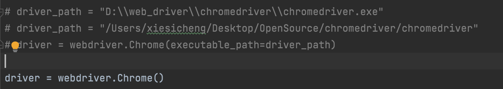
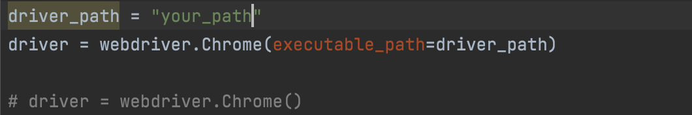

## 配置环境

python 环境为python3.6

在命令行下执行以下命令

```txt
cd `项目文件夹`
pip install -r requirements.txt --ignore-installed
```

接下来配置selenium的环境

https://blog.csdn.net/weixin_45248461/article/details/124248142

如果按教程写的，把chromedriver放在安装目录下，则code/main中的代码使用如下所示



否则，要记录下chromedriver.exe的位置

然后，将code/main中的代码改成如下所示


