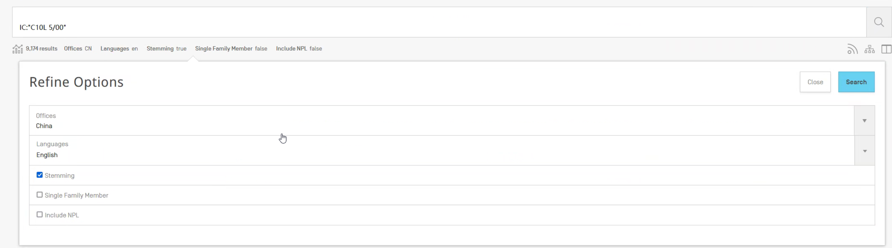
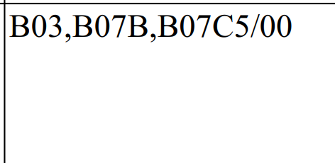

wipo
13年后可以




绿色专利的IPC号

https://www.wipo.int/classifications/ipc/green-inventory/home

数据库

Patentscope2.wipo.int/search/en/search.jsf


B60L7/10，F03B1/00，bbbbb/bb

专利1，年份，


1. 合并excel，只需要几列

   - IPC号分到二级分支（比如2.2），对于一个二级的IPC号，0/1

   - 公开号、公开日、申请日、专利类型、公开国别、权利要求数量、文献页数、首权字数、ipc主分类、ipc、国民经济分类、申请人数量、申请人类型、中国申请人省市、城市、发明人（目前是人名，最好能统计发明人数量）、被引证数量、家族引证数量、家族被引证数量、引证科技文献、简单同族个数、扩展同族个数、inpadoc同族个数、专利寿命、合享价值度、技术稳定性、技术先进性、保护范围

   - 年份合并

   - 没有"/"就是后面任意数字都匹配

     

   - 


出现的问题

- 有一些excel不一样
  - 记录一下单独处理


xls没做

E:\绿色专利（房东）\incopat\2020


1.1.1.1，2023，中国 上海，个人100个专利 企业100个专利 企业申请150 个人申请50个 发明专利100个 实用新型100个

- 发明类型：外观设计 就不用管


对于每条专利，有很多IPC号，

1.1.1.1 B60L7/10 

1.1.1.2 F03B1/00 

其他 +1+1


绿色技术IPC号的数量 +2

不是 +2


所有出现的IPC号，是不是属于学姐文档里的一项


批准号

- 数据的IPC号，属于一个或者多个IPC，还是不在范围内
  - 属于几个IPC，有几个IPC号不在范围内


- 按3级标题分类
- 如果1,2级标题没有孩子了，就看成3级标题
- 前缀匹配
- 前面的一定是以字母结尾


1. 日期类型 公开日 申请日
2. 用一个0/1变量表示有无绿色专利
3. 是否为绿色专利（首位）  属于哪一大类（7大类 0/1） 小类也要
   1. 合成一列
4. 搞两版，一版简洁，一版是所有信息都包含
   1. 信息可能有\t和\n

```
python main.py --data-path "C:\\resource\\aicourse23" --model "cait_xxs24_224" --batch-size 32 --epochs 80 --weight-decay 0.01 --output_dir output/cait_xxs24_224 --rotation 45 --flip 0.5 --add_origin_image --epoch_per_print 10 
```
